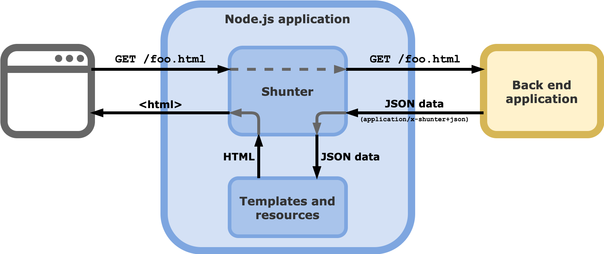
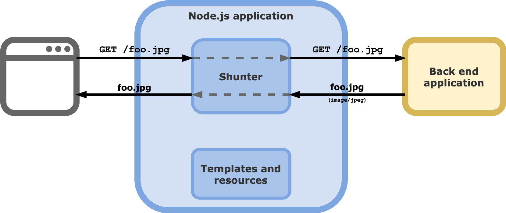
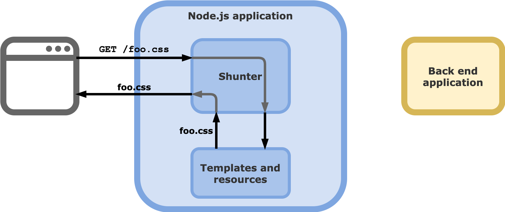

# 

Shunter is a [Node.js][node] module built to read JSON and translate it into HTML.

It helps you create a loosely-coupled front end application which can serve traffic from one or more back end applications — great for use in multi-language, multi-disciplinary teams, or just to make your project more flexible and future-proofed.

Shunter does not contain an API client, or any Controller logic (in the [MVC](https://en.wikipedia.org/wiki/Model%E2%80%93view%E2%80%93controller) sense). Instead, Shunter simply proxies requests to a back end server, then:

1. If the back end wants Shunter to render the response, it returns the application state as JSON, served with a certain HTTP header. This initiates the templating process in Shunter.

2. If the back end wishes to serve the response, it omits the header and Shunter proxies the request back to the client.

3. Shunter is also able to serve resources like CSS, JS, or images bundled with the templates as part of your application.

[![NPM version][shield-npm]][info-npm]
[![Node.js version support][shield-node]][info-node]

[![LGPL-3.0 licensed][shield-license]][info-license]

## Key features

* Allows the creation of templates loosely coupled to the underlying back end applications.
* Enables multiple back end applications to use the same unified front end.
* Makes full site redesigns or swapping out back end applications very easy.
* Completely technology-agnostic; if your application outputs JSON, it can work with Shunter.
* Asset concatenation, minification, cache-busting, and other performance optimisations built-in.
* Can output any type of content you like, e.g. HTML, RSS, RDF, etc.

## Getting started

You can find all the details about how to use Shunter in our [documentation](docs/index.md). If you're new to Shunter, we recommend reading the [Getting Started Guide](docs/getting-started.md). This will teach you the basics, and how to create your first Shunter-based application.

## Requirements

The latest version of Shunter requires [Node.js][node] v12-16.

See the [Getting started documentation](docs/getting-started.md#prerequisites) for more information on Shunter's requirements.

Instructions for [installing Node.js](https://nodejs.org/en/download) are available on their website.

## Support and migration

Shunter supports various versions of Node.js:

| Major Version | Last Feature Release | Node Versions Supported |
| :------------ | :------------------- | :--------------- |
| 5             | N/A                  | >=12 <=16 |
| 4             | 4.13                 | >=4 <=8 |
| 3             | 3.8                  | >=0.10 <=5 |

_Versions 1 and 2 of Shunter were not public releases._

If you're migrating between major versions of Shunter, we maintain a [migration guide](docs/migration/index.md) to help you.

If you'd like to know more about how we support our open source projects, including the full release process, check out our [support practices document][support].

## Contributing

We'd love for you to contribute to Shunter. We maintain a [guide to help developers](docs/developer-guide.md) get started with working on Shunter itself. It outlines the structure of the library and some of the development practices we uphold.

We also label [issues that might be a good starting-point][starter-issues] for new developers to the project.

## License

Shunter is licensed under the [Lesser General Public License (LGPL-3.0)][info-license].

Copyright &copy; 2025, Springer Nature

[brew]: http://mxcl.github.com/homebrew/
[node]: https://nodejs.org/
[npm]: https://www.npmjs.com/
[nvm]: https://github.com/nvm-sh/nvm
[starter-issues]: https://github.com/springernature/shunter/labels/good-starter-issue
[support]: https://github.com/springernature/frontend-playbook/blob/main/practices/open-source-support.md

[info-coverage]: https://coveralls.io/github/springernature/shunter
[info-dependencies]: https://gemnasium.com/springernature/shunter
[info-license]: LICENSE
[info-node]: package.json
[info-npm]: https://www.npmjs.com/package/shunter
[shield-coverage]: https://img.shields.io/coveralls/springernature/shunter.svg
[shield-dependencies]: https://img.shields.io/gemnasium/springernature/shunter.svg
[shield-license]: https://img.shields.io/badge/license-LGPL%203.0-blue.svg
[shield-node]: https://img.shields.io/badge/node.js%20support-10–14-brightgreen.svg
[shield-npm]: https://img.shields.io/npm/v/shunter.svg
