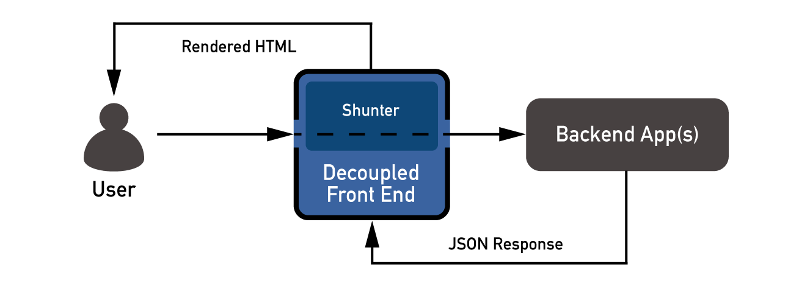

Shunter
=======

Shunter is a [Node.js][node] application built to read JSON and translate it into HTML.

[![NPM version][shield-npm]][info-npm]
[![Node.js version support][shield-node]][info-node]
[![Build status][shield-build]][info-build]
[![Dependencies][shield-dependencies]][info-dependencies]
[![LGPL-3.0 licensed][shield-license]][info-license]

Shunter works by proxying user requests through to a back-end which responds with JSON; then it uses the JSON as a render context, generating output by passing it into your templates.

- [**Read the Documentation**](docs/README.md)
- [Introduction](docs/introduction.md)
- [Getting Started](docs/getting-started.md)
- [API Documentation](docs/usage.md)
- [Developer Guide](docs/developer-guide.md)

Requirements
------------

Shunter requires [Node.js][node] 0.10 or later, which should come with [npm][npm]. This should be easy to get running on Mac and Linux.

On Windows things are a bit more complicated due to the Shunter install process requiring a C compiler. Here are some useful links to help you:

- [node-gyp Visual Studio 2010 Setup][node-gyp-vs]
- [contextify – Specified platform toolset (v110) is not installed or invalid][contextify]

Getting Started
---------------

If you're new to Shunter, we recommend our [Getting Started Guide](docs/getting-started.md). This will teach you the basics, and how to create your first Shunter application.

Contributing
------------

We maintain a developer guide to help people get started with working on Shunter itself. It outlines the structure of the application and some of the development practices we uphold.

We'd love for you to contribute to Shunter, read the [developer guide](docs/developer-guide.md) and get in touch!

License
-------

Shunter is licensed under the [Lesser General Public License (LGPL-3.0)][info-license].  
Copyright &copy; 2015, Nature Publishing Group

[contextify]: http://zxtech.wordpress.com/2013/02/20/contextify-specified-platform-toolset-v110-is-not-installed-or-invalid/
[node]: https://nodejs.org/
[node-gyp-vs]: https://github.com/TooTallNate/node-gyp/wiki/Visual-Studio-2010-Setup
[npm]: https://www.npmjs.com/

[info-dependencies]: https://gemnasium.com/nature/shunter
[info-license]: LICENSE
[info-node]: package.json
[info-npm]: https://www.npmjs.com/package/shunter
[info-build]: https://travis-ci.org/nature/shunter
[shield-dependencies]: https://img.shields.io/gemnasium/nature/shunter.svg
[shield-license]: https://img.shields.io/badge/license-LGPL%203.0-blue.svg
[shield-node]: https://img.shields.io/badge/node.js%20support-0.10–0.12-yellow.svg
[shield-npm]: https://img.shields.io/npm/v/shunter.svg
[shield-build]: https://img.shields.io/travis/nature/shunter/master.svg
